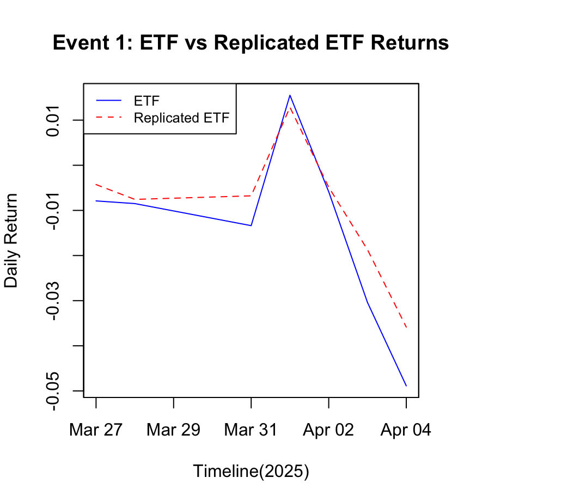
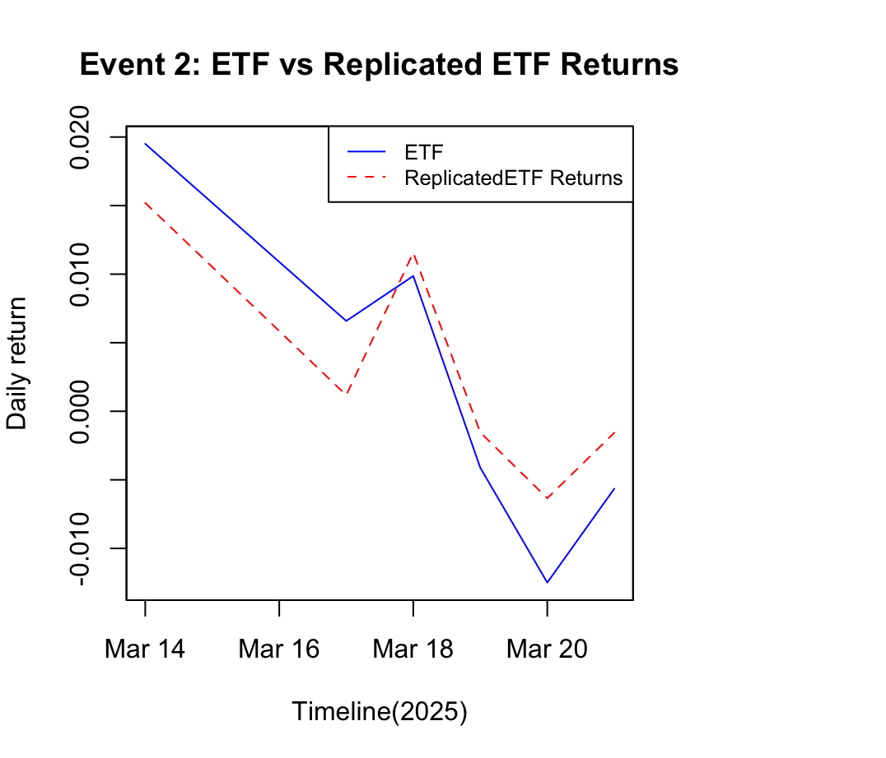

# ETF Replication Project: iShares DAX UCITS ETF (EXS1.DE)

## Introduction
This project replicates the iShares DAX UCITS ETF (EXS1.DE) using its **top 10 holdings**.  
The main objectives are:
- Replicate the ETF using top 10 holdings.  
- Compare replicated ETF performance vs the real ETF.  
- Evaluate performance metrics such as **correlation, tracking error, CAPM Beta, and excess return**.  
- Perform **event-window analysis** on selected market events.  
- Visualize cumulative returns and event impacts.

## Data
- **ETF Holdings**: Scraped top 10 holdings from [justetf.com](https://www.justetf.com/en/etf-profile.html?isin=DE0005933931#overview) using `rvest`.  
- **Price Data**: Daily adjusted prices downloaded via Yahoo Finance using `quantmod`.  
- **Returns Calculation**: Daily returns calculated using `PerformanceAnalytics::Return.calculate()` with **discrete method**.

## Methodology
1. **ETF Replication**
   - Daily returns of each of the **top 10 holdings** were multiplied by their respective weight in the ETF.  
   - **Replicated ETF return** = sum(weighted returns of all holdings).  

2. **Performance Metrics**
   - **Correlation (replicated ETF vs actual ETF)**: 0.91996  
   - **Tracking Error**: 0.004018  
   - **Excess Return (vs DAX Index)**: 0.0001334  
   - **CAPM Beta (vs DAX Index)**: 0.68494  

3. **Event Analysis**
   - **Event 1 (2025-03-31)**:  
     - Germany stocks lower at close of trade; DAX down 1.33%  
     - European stocks fall as tariffs concerns weigh; Primark CEO resigns  
     - “Make Europe Great Again” trades gaining traction  
   - **Event 2 (2025-03-18, Siemens AG – 10% of ETF)**:  
     - Siemens to cut jobs in automation and EV charging sectors globally  
     - Siemens to cut 8% of jobs at struggling factory automation business  

   - Event analysis involved comparing **replicated ETF vs actual ETF returns** in ±4 day windows around the events.

## Results
### **Cumulative Returns**

### **Event Plots**
- **Event 1**  
  
- **Event 2 (Siemens)**  

### **Top 10 Holdings vs ETF vs Replicated ETF**

## Skills & Packages Used
- **R Packages**: `rvest`, `quantmod`, `PerformanceAnalytics`, `timetk`, `zoo`, `tidyverse`  
- **Skills**:
  - Scraping static HTML tables with `rvest`  
  - Time series data manipulation with `xts` and `timetk`  
  - Portfolio replication and performance analysis  
  - Event-window analysis and visualization  

